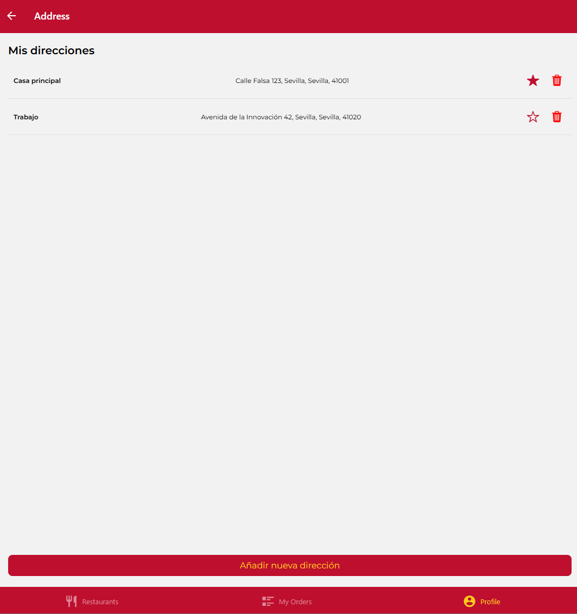
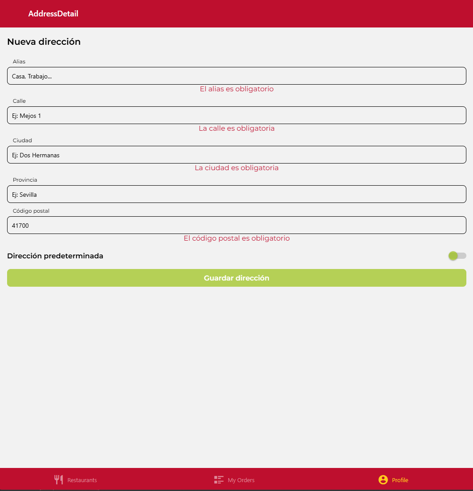

# Examen DeliverUS - Modelo A - Gestión de direcciones de envío - Julio'25

Recuerde que DeliverUS está descrito en: <https://github.com/IISSI2-IS-2025>

## Enunciado del examen
Este examen tiene como objetivo desarrollar una interfaz web que permita a un cliente autenticado **gestionar sus direcciones de envío**, utilizando la API REST del backend DeliverUS proporcionada en el examen de julio (modelo A).

El desarrollo debe seguir el estilo modular de los laboratorios asignatura.  

## Requisitos funcionales

Se deben implementar las siguientes funcionalidades:

### RF1. Listar direcciones de envío del usuario autenticado
- Mostrar en pantalla todas las direcciones de envío del cliente actual (`GET /shippingaddresses`).
- Indicar claramente cuál es la dirección predeterminada (`isDefault: true`).

Se podría ver de manera similar a la indicada en la figura:



### RF2. Crear una nueva dirección de envío
- Formulario para crear una nueva dirección (`POST /shippingaddresses`) con los siguientes campos obligatorios:
  - `alias`, `street`, `city`, `zipCode`, `province`
- Si la dirección es la primera del usuario, debe quedar marcada automáticamente como predeterminada.




### RF3. Marcar una dirección como predeterminada
- Botón en cada dirección para marcarla como predeterminada (`PATCH /shippingaddresses/:shippingAddressId/default`).
- Debe actualizarse la interfaz para reflejar el nuevo estado.

")


### RF4. Eliminar una dirección
- Botón en cada dirección para eliminarla (`DELETE /shippingaddresses/:shippingAddressId`).
- Debe solicitarse confirmación antes del borrado.

")

## Preparación del Entorno

### a) Windows

- Abre una terminal y ejecuta el siguiente comando:

    ```bash
    npm run install:all:win
    ```

### b) Linux/MacOS

- Abre una terminal y ejecuta el siguiente comando:

    ```bash
    npm run install:all:bash
    ```

## Ejecución

### Backend

- Para **recrear las migraciones y seeders**, abre una terminal y ejecuta el siguiente comando:

    ```bash
    npm run migrate:backend
    ```

- Para **iniciar el backend**, abre una terminal y ejecuta el siguiente comando:

    ```bash
    npm run start:backend
    ```

### Frontend

- Para **ejecutar la aplicación frontend del `owner`**, abre una nueva terminal y ejecuta el siguiente comando:

    ```bash
    npm run start:frontend
    ```

## Depuración

- Para **depurar el frontend**, asegúrate de que **SÍ** haya una instancia en ejecución del frontend que deseas depurar, y usa las herramientas de depuración del navegador.
